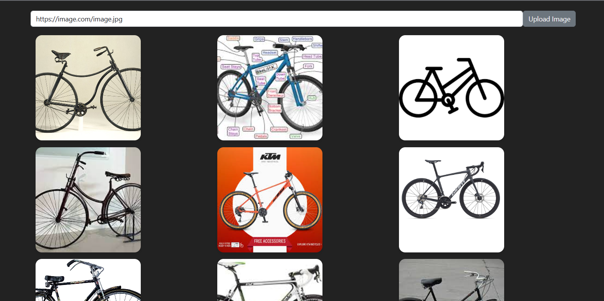

# Image Search Flask Application



**Note: This project is an experimental endeavor and serves as Part 2 of another project named 'Similar-vehicles'. You can find the first part of the project at [https://github.com/ivanrj7j/Similar-vehicles](https://github.com/ivanrj7j/Similar-vehicles).**

This is a Flask web application that allows users to perform image searches using a custom algorithm. Users can upload an image or provide a URL, and the application will find similar images from the provided dataset.

## Table of Contents

- [Getting Started](#getting-started)
  - [Forking the Repository](#forking-the-repository)
- [How the Algorithm Works](#how-the-algorithm-works)
- [Resources Used](#resources-used)
- [Usage](#usage)
- [Contributing](#contributing)
- [License](#license)

## Getting Started

### Forking the Repository

To get started with the Image Search Flask Application, you first need to fork this repository. Click the "Fork" button at the top right corner of the page to create your copy of the repository.

Once you have forked the repository, you can clone it to your local machine using the following command:

```bash
git clone https://github.com/your-username/Image-Search
```

## How the Algorithm Works

The algorithm used in this application follows these steps:

1. **Training the Classification Model**: Initially, a classification model is trained on a dataset containing several images of vehicles. The model learns to classify vehicles into different categories (e.g., cars, trucks, motorcycles).

2. **Feature Representation**: Once the classification model is trained, we modify it to utilize the last hidden layer's output as a feature representation for the input image. This hidden layer typically contains a compact and meaningful representation of the image.

3. **Representing Images in the Database**: For each image in the database, we pass it through the modified model to obtain its feature representation. This feature representation serves as a numerical representation of the image, capturing its essential characteristics.

4. **Similarity Measurement**: When a user queries an image, the same feature extraction process is applied to the query image. The algorithm then calculates the cosine similarity between the query image's feature representation and the feature representations of all the images in the database.

5. **Ranking and Displaying Results**: The database images are ranked based on their cosine similarity scores in ascending order. Images with higher similarity scores are considered more similar to the query image. The top-ranked images (most similar) are then displayed to the user on the web application.

By using the last hidden layer's output as a feature representation, the algorithm can capture relevant patterns in the images, allowing it to find visually similar images effectively.

## Resources Used

The following technologies and resources were used in the development of this application:

- Backend: Flask
- Frontend: JavaScript
- User Interface: Bootstrap
- AI Related: TensorFlow

## Contributing

We welcome contributions to improve the Image Search Flask Application. If you find any bugs or have suggestions for new features, please feel free to open an issue or submit a pull request. We will review your contributions and merge them as appropriate.

## License

This project is licensed under the [MIT License](LICENSE). Feel free to use and modify the code as per the terms of the license.
